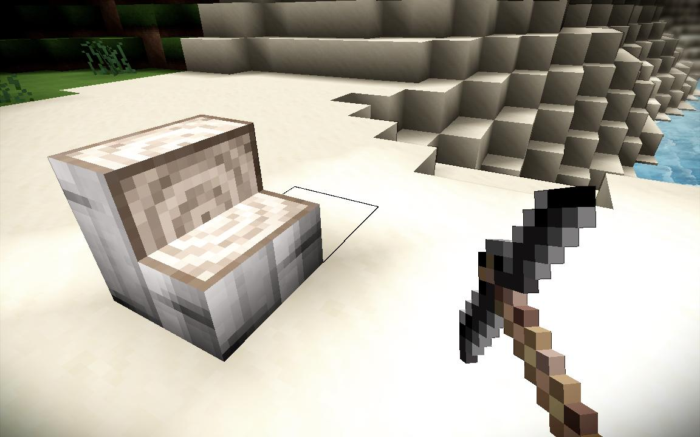

.. _block_access:

Accessing Blocks
================

There are two things that are generated by block definitions - blocks themselves, with their specific settings, 
:ref:`Shapes <block_shapes>` and rotations, and :ref:`Block Families <block_families>` which are sets of blocks that are considered to be variations of the same block. 

If a block doesn't define a shape, or defines multiple shapes, 
then it is made available as a full block via the uri :code:`moduleName:blockName`, 
where the *moduleName* is the id of the containing module or :code:`engine` for build in blocks.
The *blockName* is the filename of the block (ignoring the extension). 
It can also be requested in any shape by using the uri :code:`blockModule:blockName:shapeModule:shapeName`.

The engine provides an api to access blocks, the :java:ref:`BlockManager <org.terasology.world.block.BlockManager>`.
For example to get a stair pointing to the left from :code:`BirchTrunk.block` (defined in the core module), inject the block manager:

.. code-block:: java

   @In
   private BlockManager blockManager;
   
And then access the block via its URI:

.. code-block:: java

   Block block = blockManager.getBlock("core:BirchTrunk:engine:stair.LEFT");

This will lookup the block :code:`core:BirchTrunk`, 
using the shape :code:`engine:stair` and use the block from this family which is rotated to the left.

   
.. note::   

   If a block has a shaped defined it can only be requested using the block uri, and its shape is fixed.
   
   For example, a ladder has always a shape of :code:`verticalOffsetPlane`, as defined in :code:`ladder.block`.
   
   .. code-block:: none
   
       ...
       "shape": "engine:verticalOffsetPlane",
       ...
   
   In this case it is not possible to get an :code:`engine:stair` instance of the ladder block.

