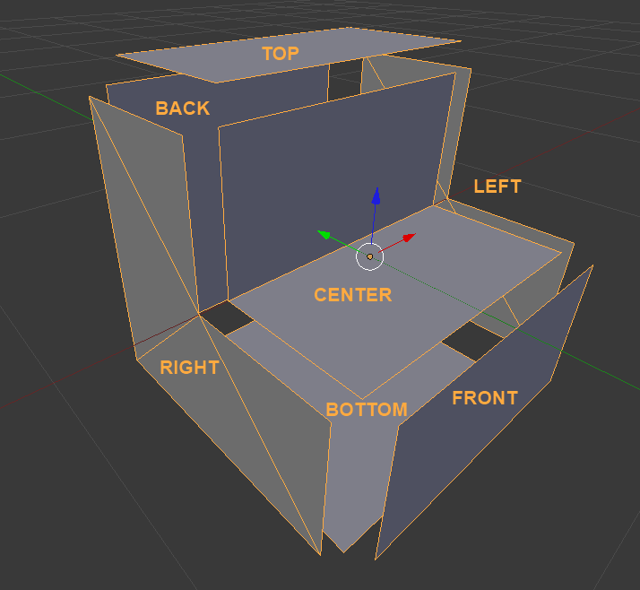

.. _block_shapes:
   
Shapes
======

A block shape defines a way a block can look - its shape. It is independent from a block tile/texture.
This allows the game engine to use new shapes for already defined blocks and tiles and vice versa.
Shapes are defined under :code:`assets/shapes` in json format and should have a :code:`.shape` extension.

.. _block_shape_basics:

Block Shape Basics
------------------

Each shape is composed of up to 7 parts:

- The **center** mesh, which is always rendered if present (visible). 
  This is typically used for parts of the block contained within the area of the block.
- Six side meshes (**Back**, **Front**, **Top**, **Bottom**, **Right**, **Left**)- one for each direction. 
  These are only rendered if the side is not obscured.

Additionally, each side is either a full side or a partial side. 
A full side fills the entire side of the block, and so obscures the sides of adjacent blocks. 
A partial side does not, as adjacent blocks are not entirely covered by these sides.
  
The image shows an example stair block shape, with each side moved away from the center. 
In the stair block, the back and bottom sides are full sides, while the top, front, left and right sides are not.

.. _block_shape_parts:

Shape Parts
-----------

Shape parts define a shape. 
Each part contain on ore more mesh part blocks from the following table.

+----------+-----------+
| Part     | Direction |
+==========+===========+
| Center   |           |
+----------+-----------+
| Right    | X+        |
+----------+-----------+
| Left     | X-        |
+----------+-----------+
| Top      | Y+        |
+----------+-----------+
| Bottom   | Y-        |
+----------+-----------+
| Back     | Z+        |
+----------+-----------+
| Front    | Z-        |
+----------+-----------+

.. note::

   Generally the front of the block is the side you expect to face towards the player when they are placing it - 
   the front of stairs, or the lit part of a torch.
   
.. note::

   A standard block is centered on the origin, with each side 0.5 units away in the appropriate direction.

Each shape part block contains the following components:

- vertices - a list of 3D vectors that make up the mesh part.
- normals - a list of normals corresponding to the vertices.
- texCoords - the texture coordinates corresponding to the vertices.
- faces - one or more lists of indices corresponding to vertices, each of which forms a polygon that comporises the mesh part.
- fullSide - a boolean denoting whether a side obscures all adjacent sides or not - 
  basically whether it is a square the fills that side of the cube. 
  This isn't used by the center mesh part, and if not specified defaults to false.

Colliders
---------
Additionally a Shape may contain a Colliders section, if it wishes to have a collision shape other than the full block. 
Stairs, for instance, have two colliders - one for the bottom step and one for the top.

.. _block_shape_example:

Shape Example
-------------

A shortened example of the :code:`stairs.shape`.
Note, that it is not necessary to create these by hand. Instead there is a workflow to :ref:`create shapes from blender <block_shapes_in_blender>`

.. code-block:: none

   {
       "author": "Immortius",
       "exportDate": "2012-07-30 21:12:39",
       "displayName": "Stairs",
       "center": {
           "vertices": [[-0.500000, 0.000000, -0.000000], ..., [-0.499999, 0.000000, -0.500000]],
           "normals": [[-0.000000, 0.000000, -1.000000], ..., [-0.000000, 1.000000, 0.000000]],
           "texcoords": [[1.000000, 0.500000], ..., [0.999999, 1.000000]],
           "faces": [
               [0, 1, 2, 3],
               [4, 5, 6, 7]
           ],
           "fullSide": false
       },
       "top": {
           "vertices": [[0.500000, 0.500000, 0.500000], ..., [-0.500000, 0.500000, 0.500000]],
           "normals": [[-0.000000, 0.999969, 0.000000], ..., [-0.000000, 1.000000, 0.000000]],
           "texcoords": [[0.000000, 0.000000], ..., [1.000000, 0.000000]],
           "faces": [
               [0, 1, 2, 3]
           ],
           "fullSide": false
       },
       "bottom": {
           ...
       },
       "front": {
           ...
       },
       "back": {
           ...
       },
       "left": {
           ...
       },
       "right": {
           "vertices": [[0.500000, 0.000000, 0.000000], ..., [0.500000, -0.500000, 0.500000]],
           "normals": [[1.000000, 0.000000, 0.000000], ..., [1.000000, -0.000001, 0.000000]],
           "texcoords": [[0.500000, 0.500000], ..., [0.000000, 1.000000]],
           "faces": [
               [0, 1, 2],
               [3, 4, 5],
               [6, 7, 8],
               [9, 10, 11]
           ],
           "fullSide": false
       },
       "collision": {
           "colliders": [
               {
                   "type": "AABB",
                   "position": [0.000000, -0.250000, -0.250000],
                   "extents": [0.500000, 0.250000, 0.250000]
               },
               {
                   "type": "AABB",
                   "position": [-0.000000, 0.000000, 0.250000],
                   "extents": [0.500000, 0.500000, 0.250000]
               }
           ]
       }
   }
